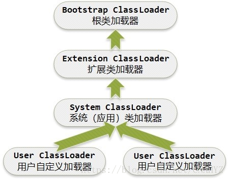
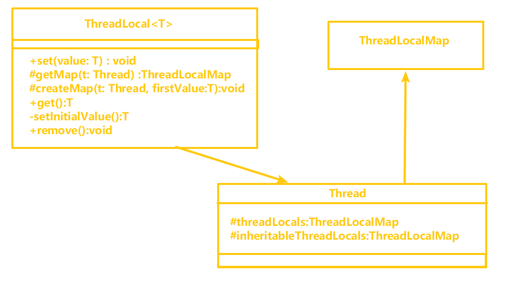
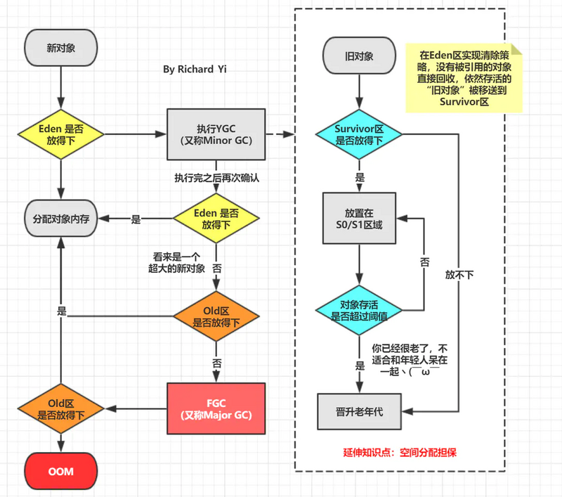

字节客户端一面（55 min）

<!--more-->

## 一面（55分钟，估计是凉了）

- 自我介绍
- 有无实习经历，介绍一下
  > 说了之前在一个小公司做的事情，感觉自己说的稀里糊涂的，可能也没抓到面试官的重点
   
- 了解过Android开发吗？
  > 【只是接触过，没有很深的了解，只理解大概的一个流程，所以面试官就问Java了开始】
 
- 类加载机制【双亲委派那些，我给答成了虚拟机加载类了】，
  >  全盘负责：当一个类加载器加载某个Class时，该Class所依赖和引用的其它Class也将由该类加载器负责载入，除非显式的使用另外一个类加载器来载入。

  >  双亲委派：当一个类加载器收到了类加载请求，它会把这个请求委派给父（parent）类加载器去完成，依次递归，因此所有的加载请求最终都被传送到顶层的启动类加载器中。只有在父类加载器无法加载该类时子类才尝试从自己类的路径中加载该类。（注意：类加载器中的父子关系并不是类继承上的父子关系，而是类加载器实例之间的关系。）

  > 缓存机制：缓存机制会保证所有加载过的Class都会被缓存，当程序中需要使用某个类时，类加载器先从缓冲区中搜寻该类，若搜寻不到将读取该类的二进制数据，并转换成Class对象存入缓冲区中。这就是为什么修改了Class后需重启JVM才能生效的原因。
  
 
- 为什么用双亲委派机制，解决了什么问题？【只回答了第一个，但是说的也不好】
  > 双亲委派机制使得类的加载出现层级,父类加载器加载过的类,子类加载器不会重复加载.可以防止类的重复加载.
  > 使得类的加载出现优先级,防止核心API被篡改,提供了安全方面的考量.所以越基础的类就会越上层进行加载.
 

- 继承和多态？

 

- Java多线程如何实现？
  > 主要有两种，一个是继承Thread类，另一个是实现Runnable接口和Callable接口，其中，Runnable无返回值，Callable可以结合FeatureTask获取返回值。
  > 还可以使用线程池的方式进行创建。ThreadPoolExecutor，最底层也是利用了Runnable接口。 
 
- Java的多线程怎么实现同步？
  >用Synchronized（锁）、使用特殊域变量(volatile)实现线程同步、用Lock锁（Reentrantlock）、使用原子类
 
- synchronized怎么用？修饰静态方法和非静态方法有什么区别？
  - [https://zhuanlan.zhihu.com/p/377423211]
  > 它修饰的对象有以下几种：
  > 1. 修饰一个代码块，被修饰的代码块称为同步语句块，其作用的范围是大括号{}括起来的代码，作用的对象是调用这个代码块的对象；
  > 2. 修饰一个方法，被修饰的方法称为同步方法，其作用的范围是整个方法，作用的对象是调用这个方法的对象；
  > 3. 修饰一个静态的方法，其作用的范围是整个静态方法，作用的对象是这个类的所有对象；
  > 4. 修饰一个类，其作用的范围是synchronized后面括号括起来的部分，作用主的对象是这个类的所有对象。
  > ----
   
  > 区别：
  > 1. Synchronized修饰非静态方法，实际上是对调用该方法的对象加锁，俗称“对象锁”。
  > 2. Synchronized修饰静态方法，实际上是对该类对象加锁，俗称“类锁”。

  >------------
  > 补充：
  > 1. synchronized是一个关键字而lock是一个接口（lock、lockInterruptibly、tryLock、unlock、newCondition）。
  > 2. synchronized是隐式的加锁，lock是显示的加锁。
  > 3. synchronized可以作用在方法和代码块上，而lock只能作用在代码块上。
      synchronized作用在静态方法上锁的是当前类的class，作用在普通方法上锁的是当前类的对象。
      在javap反编译成字节码后，synchronized关键字需要有一个代码块进入的点monitorenter，代码块退出和代码块异常的出口点monitorexit。
  >  4. synchronized是阻塞式加锁，而lock中的trylock支持非阻塞式加锁。
  >  5. synchronized没有超时机制，而lock中的trylcok可以支持超时机制。
  >  6. synchronized不可中断，而lock中的lockInterruptibly可中断的获取锁。（ReentrantLock.lockInterruptibly允许在等待时由其它线程调用等待线程的Thread.interrupt方法来中断等待线程的等待而直接返回，这时不用获取锁，而会抛出一个InterruptedException。 ReentrantLock.lock方法不允许Thread.interrupt中断,即使检测到Thread.isInterrupted,一样会继续尝试获取锁，失败则继续休眠。只是在最后获取锁成功后再把当前线程置为interrupted状态,然后再中断线程。）
  >   7. synchronized采用的是monitor对象监视器，lock的底层原理是AQS
  >  8. synchronized只有一个同步队列和一个等待队列，而lock有一个同步队列，可以有多个等待队列。
    同步队列：排队取锁的线程所在的队列。
    等待队列：调用 wait 方法后，线程会从同步队列转移到等待队列。
  >  9. synchronized是非公平锁，而lock可以是公平锁也可以是非公平锁。
  >  10. synchronized用object的notify方法进行唤醒，而lock用condition进行唤醒。
  >  11. lock有ReadWriteLock支持并发读。

 

- synchronized是可重入锁吗？什么是可重入锁，可重入锁原理是什么？
  > - 是可重入锁；
  > - 可重入锁：同一个线程重复请求由自己持有的锁对象时，可以请求成功而不会发生死锁
  > - 原理：
  >  > 1. synchronized底层的实现原理是利用计算机系统的mutex Lock实现。每一个可重入锁都会关联一个线程ID和一个锁状态status。
  >  > 2. 当一个线程请求方法时，会去检查锁状态，如果锁状态是0，代表该锁没有被占用，直接进行CAS操作获取锁，将线程ID替换成自己的线程ID。 如果锁状态不是0，代表有线程在访问该方法。此时，如果线程ID是自己的线程ID，如果是可重入锁，会将status自增1，然后获取到该锁，进而执行相应的方法。如果是非重入锁，就会进入阻塞队列等待。
  > > 3. 释放锁时，可重入锁，每一次退出方法，就会将status减1，直至status的值为0，最后释放该锁。 释放锁时，非可重入锁，线程退出方法，直接就会释放该锁。

 

- 用过ThreadLocal吗?
  > - 没有用过，用过InheritableThreadLocal，因为子线程可以贡献，名字还读不出来，说了个In开头的那个 
  > - 多线程访问同一个共享变量的时候容易出现并发问题，特别是多个线程对一个变量进行写入的时候，为了保证线程安全，一般使用者在访问共享变量的时候需要进行额外的同步措施才能保证线程安全性。ThreadLocal是除了加锁这种同步方式之外的一种保证一种规避多线程访问出现线程不安全的方法，当我们在创建一个变量后，如果每个线程对其进行访问的时候访问的都是线程自己的变量这样就不会存在线程不安全问题。
  > - 下面是ThreadLocal的类图结构，
  
  从图中可知：Thread类中有两个变量threadLocals和inheritableThreadLocals，二者都是ThreadLocal内部类ThreadLocalMap类型的变量，我们通过查看内部内ThreadLocalMap可以发现实际上它类似于一个HashMap。在默认情况下，每个线程中的这两个变量都为null，只有当线程第一次调用ThreadLocal的set或者get方法的时候才会创建他们（后面我们会查看这两个方法的源码）。除此之外，和我所想的不同的是，每个线程的本地变量不是存放在ThreadLocal实例中，而是放在调用线程的ThreadLocals变量里面（前面也说过，该变量是Thread类的变量）。也就是说，ThreadLocal类型的本地变量是存放在具体的线程空间上，其本身相当于一个装载本地变量的工具壳，通过set方法将value添加到调用线程的threadLocals中，当调用线程调用get方法时候能够从它的threadLocals中取出变量。如果调用线程一直不终止，那么这个本地变量将会一直存放在他的threadLocals中，所以不使用本地变量的时候需要调用remove方法将threadLocals中删除不用的本地变量。下面我们通过查看ThreadLocal的set、get以及remove方法来查看ThreadLocal具体实怎样工作的

 

- ArrayList的实现原理？怎么扩容的？扩容之后，数据是怎么处理的？
  > ArrayList的实现原理总结如下： 
  > - 数据存储是基于数组实现的，默认初始容量为10；
    添加数据时，首先需要检查元素个数是否超过数组容量，如果超过了则需要对数组进行扩容； 
  > - 插入数据时，需要将插入点k开始到数组末尾的数据全部向后移动一位。 
  > - 数组的扩容是新建一个大容量（原始数组大小+扩充容量）的数组，然后将原始数组数据拷贝到新数组，然后将新数组作为扩容之后的数组。数组扩容的操作代价很高，我们应该尽量减少这种操作。 
  > - 删除数据时，需要将删除点+1位置开始到数组末尾的数据全部向前移动一位。 
  > - 获取数据很快，根据数组下表可以直接获取。
  > ------------------------
  >-----------
  >  在具体实现中，ArrayList的扩容机制是这样的： 
  > - 当向ArrayList中添加元素时，首先会检查ArrayList的当前大小（也就是它内部的数组大小）是否能够容纳新的元素。如果可以，那么新元素就直接被添加到ArrayList中。
  > -   如果ArrayList的当前大小不足以容纳新的元素，那么ArrayList就需要进行扩容操作。在扩容操作中，ArrayList会创建一个新的数组，新数组的大小是原数组大小的1.5倍（也就是原数组大小+原数组大小的一半）。这个1.5倍的值是在JDK的源码中定义的。
  > -   然后，ArrayList会使用System.arraycopy方法，将原有数组中的所有元素复制到新的数组中。
  > -   最后，新的数组会替代原有的数组，成为ArrayList的内部数组。

 

- 线程与进程的区别？
  > - 线程:一个在内存中运行的应用程序。每个进程都有自己独立的一块内存空间，一个进程可以有多个线程，比如在Windows系统中，一个运行的xx.exe就是一个进程。
    > - 进程中的一个执行任务（控制单元），负责当前进程中程序的执行。一个进程至少有一个线程，一个进程可以运行多个线程，多个线程可共享数据。
    与进程不同的是同类的多个线程共享进程的堆和方法区资源，但每个线程有自己的程序计数器、虚拟机栈和本地方法栈，所以系统在产生一个线程，或是在各个线程之间作切换工作时，负担要比进程小得多，也正因为如此，线程也被称为轻量级进程。
  > -------------------
  > - 区别:
  > >    - 根本区别：进程是操作系统资源分配的基本单位，而线程是处理器任务调度和执行的基本单位
  > >    - 资源开销：每个进程都有独立的代码和数据空间（程序上下文），程序之间的- 切换会有较大的开销；线程可以看做轻量级的进程，同一类线程共享代码和数据空间，每个线程都有自己独立的运行栈和程序计数器（PC），线程之间切换的开销小。
  > >    - 包含关系：如果一个进程内有多个线程，则执行过程不是一条线的，而是多条线（线程）共同完成的；线程是进程的一部分，所以线程也被称为轻权进程或者轻量级进程。
  > >    - 内存分配：同一进程的线程共享本进程的地址空间和资源，而进程之间的地址空间和资源是相互独立的
  > >    - 影响关系：一个进程崩溃后，在保护模式下不会对其他进程产生影响，但是一个线程崩溃整个进程都死掉。所以多进程要比多线程健壮。
  > >    -  执行过程：每个独立的进程有程序运行的入口、顺序执行序列和程序出口。  线程不能独立执行，必须依存在应用程序中，由应用程序提供多个线程执行控制，两者均可并发执行

 

- Java中，强引用，软引用，弱引用和虚引用？弱引用和软引用区别？
  > 强引用：使用的大部分都是强引用，是最普遍的引用。<front color=Red>【如果一个对象具有强引用，不会被垃圾回收器回收。当空间不足时候，Java虚拟机会抛出OOM错误，使程序异常终止也不回收这种对象】</front>

  > 软引用：一些有用但不是必须的对象。在Java中，用`java.lang.ref.SoftReference`类来表示。对于软引用关联着的对象，只有在内存不足的时候jvm才会回收该对象。这个特性适合用来实现缓存：比如网页缓存、图片缓存。

  > 弱引用：描述一些非必须对象。在java中，用`java.lang.ref.WeakReference`类来表示。当JVM进行垃圾回收时，无论内存是否充足，都会回收被弱引用关联的对象。
  > >弱引用与软引用的区别在于：只具有弱引用的对象拥有更短暂的生命周期。在垃圾回收器线程扫描它所管辖的内存区域的过程中，一旦发现了只具有弱引用的对象，不管当前内存空间足够与否，都会回收它的内存。不过，由于垃圾回收器是一个优先级很低的线程， 因此不一定会很快发现那些只具有弱引用的对象。所以被软引用关联的对象只有在内存不足时才会被回收，而被弱引用关联的对象在JVM进行垃圾回收时总会被回收。

  > 虚引用：虚引用和前面的软引用、弱引用不同，它并不影响对象的生命周期。在java中用java.lang.ref.PhantomReference类表示。如果一个对象与虚引用关联，则跟没有引用与之关联一样，在任何时候都可能被垃圾回收器回收。虚引用主要用来跟踪对象被垃圾回收的活动。
  >> 虚引用必须和引用队列关联使用，当垃圾回收器准备回收一个对象时，如果发现它还有虚引用，就会把这个虚引用加入到与之 关联的引用队列中。程序可以通过判断引用队列中是否已经加入了虚引用，来了解被引用的对象是否将要被垃圾回收。如果程序发现某个虚引用已经被加入到引用队列，那么就可以在所引用的对象的内存

    |引用类型|被回收时间|用途|生存时间|
    |-------|---------|----|-------|
    |强引用 |从来不会 | 对象的一般状态|JVM停止运行时|
    |软引用 |内存不足时 | 对象缓存|内存不足时|
    |弱引用 |垃圾回收时候 | 对象缓存|GC后|
    |虚引用 |未知 | 未知|未知|

 

- ==和equal的区别？
  > 经典题目了，==比较的是值，equal比较的是内容。下面详细说:
  >> 基本数据类型（也称原始数据类型） ：byte,short,char,int,long,float,double,boolean。他们之间的比较，应用双等号（==）,比较的是他们的值。 
  >> 引用数据类型：当他们用（==）进行比较的时候，比较的是他们在内存中的存放地址（确切的说，是堆内存地址）。

  >> equal不能用来比较基本数据类型，它是Object的一个方法，默认是比较地址值。 
  >> 不过，我们可以根据情况自己重写该方法，来比较对象的内容。

 

- 线程池用过吗？【我说没有，问我了解过吗】说一说原理【一个线程来了，如何进行工作?】
 > 举例一个任务进来，线程池如何处理：  
 >> 一个任务进来，先判断线程池中的数量小于corePoolSize，即使线程池线程都处于空闲状态，也要创建新的线程来处理被添加的任务  
 >> 如果此时线程池中的数量等于corePoolSize，但是缓冲池中未满，则放入缓冲队列。  
 >> 如果此时线程池中数量大于等于cprePoolSize,缓冲池也满了，并且线程池中的数量小于 maximumPoolSize，则新建线程来处理被添加的任务  
 >> 如果线程池中数量大于corePoolSize,缓冲队列满了，线程池中数量等于maxinumPoolSize，通过指定的拒绝策略来进行拒绝。  

 > 总结： 
 >> 处理任务判断优先级为核心线程corePoolSize、任务队列workQuene、最大线程maxinumPoolSize，如果三者都满了，则使用handler中的拒绝策略来拒绝任务。
 >>> 扩展：拒绝策略
 >>>>> AbortPolicy： 直接拒绝所提交的任务，并抛出`RejectedExecutionException`异常； 
 >>>>> CallerRunsPolicy：只用调用者所在的线程来执行任务； 
 >>>>> DiscardPolicy：不处理直接丢弃掉任务； 
 >>>>> DiscardOldestPolicy：丢弃掉阻塞队列中存放时间最久的任务，执行当前任务。

 

- 线程池的决绝策略有哪些？ 【这个好像回答了三个上来，CallerRunsPolicy没回答上来】
  > `AbortPolicy`: 这种拒绝策略在拒绝任务时，会直接抛出一个类型为 RejectedExecutionException的RuntimeException，让你感知到任务被拒绝了，于是你便可以根据业务逻辑选择重试或者放弃提交等策略。 
  > `DiscardPolicy`:这种拒绝策略正如它的名字所描述的一样，当新任务被提交后直接被丢弃掉，也不会给你任何的通知，相对而言存在一定的风险，因为我们提交的时候根本不知道这个任务会被丢弃，可能造成数据丢失。 
  > `DiscardOldestPolicy`:如果线程池没被关闭且没有能力执行，则会丢弃任务队列中的头结点，通常是存活时间最长的任务，这种策略与第二种不同之处在于它丢弃的不是最新提交的，而是队列中存活时间最长的，这样就可以腾出空间给新提交的任务，但同理它也存在一定的数据丢失风险。  
  > `CallerRunsPolicy`: 第4种拒绝策略是 CallerRunsPolicy，相对而言它就比较完善了，当有新任务提交后，如果线程池没被关闭且没有能力执行，则把这个任务交于提交任务的线程执行，也就是谁提交任务，谁就负责执行任务。这样做主要有两点好处。
  >>  第一点新提交的任务不会被丢弃，这样也就不会造成业务损失。 
      第二点好处是，由于谁提交任务谁就要负责执行任务，这样提交任务的线程就得负责执行任务，而执行任务又是比较耗时的，在这段期间，提交任务的线程被占用，也就不会再提交新的任务，减缓了任务提交的速度，相当于是一个负反馈。在此期间，线程池中的线程也可以充分利用这段时间来执行掉一部分任务，腾出一定的空间，相当于是给了线程池一定的缓冲期。

 

- Java垃圾回收机制？GC原理？算法有哪些？ 【回收机制好像回答的有问题】
  > 回收机制回答：
  >> GC区域在哪？
  >> 确定哪些内存需要回收？【计数法和可达性分析】
  >> 什么时候回收？
  >> 怎么回收？【采用哪种回收算法？】
  
  > 分代收集  回收机制:
  >> 1. 新产生的对象优先分配在Eden区（除非配置了-XX:PretenureSizeThreshold，大于该值的对象会直接进入年老代）； 
  >> 2. 当Eden区满了或放不下了，这时候其中存活的对象会复制到from区。
  >>>>> 这里，需要注意的是，如果存活下来的对象from区都放不下，则这些存活下来的对象全部进入年老代。之后Eden区的内存全部回收掉。
  >> 3. 之后产生的对象继续分配在Eden区，当Eden区又满了或放不下了，这时候将会把Eden区和from区存活下来的对象复制到to区（同理，如果存活下来的对象to区都放不下，则这些存活下来的对象全部进入年老代），之后回收掉Eden区和from区的所有内存。
  >> 4. 如上这样，会有很多对象会被复制很多次（每复制一次，对象的年龄就+1），默认情况下，当对象被复制了15次（这个次数可以通过：-XX:MaxTenuringThreshold来配置），就会进入年老代了。
  >> 5. 当年老代满了或者存放不下将要进入年老代的存活对象的时候，就会发生一次Full GC（这个是我们最需要减少的，因为耗时很严重）。

  > 原理：
  >> 通常GC采用有向图的方式记录和管理堆的所有对象，通过这种方式确定哪些对象是“可达的”，哪些对象是“不可达的”。当GC确定一些对象不可达时，GC这时候就有责任回收这些内存空间。

  > 创建对象时，出发GC的流程
  > 

  > 算法：
  >> 标记清除、标记整理、复制、分代收集

   

- 算法题：统计字符串出现最多的，以及其次数？【面试题很简单本来想用python写，面试官问可不可以用Java，所以，还是Java写的，但是输入忘记咋写了，难啊！！好在面试官说可以不写输入了，唉面向过程编程了】
 > 思路上不讲究效率的话，直接一个遍历+map,记录最大值；最后，在走一遍map，打印出全部map.value与max相等的键以及值。